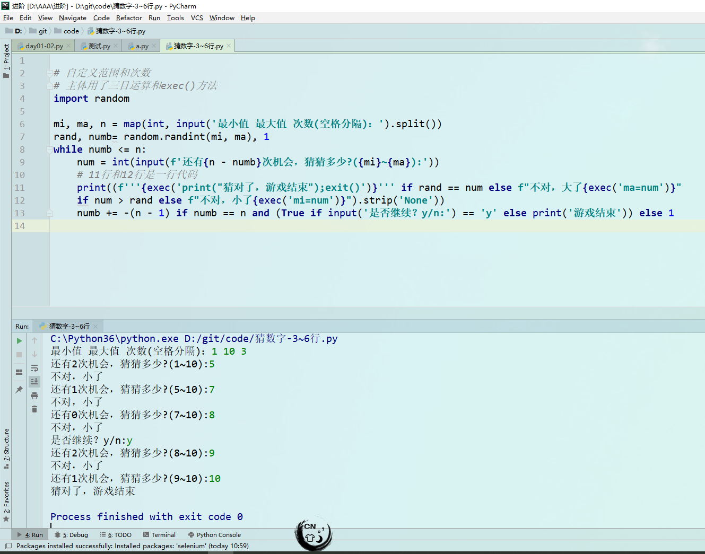
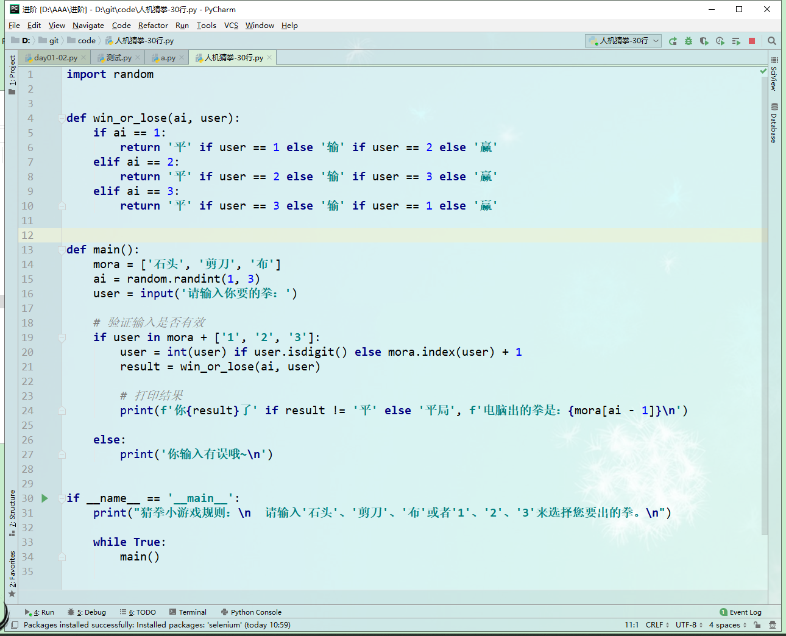
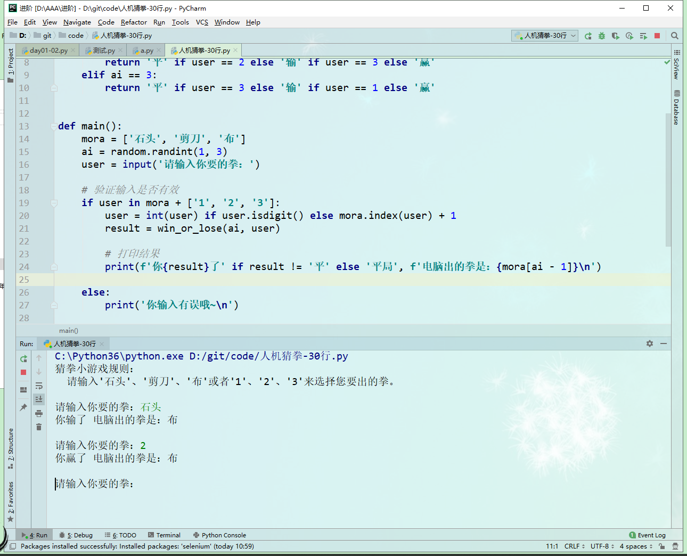
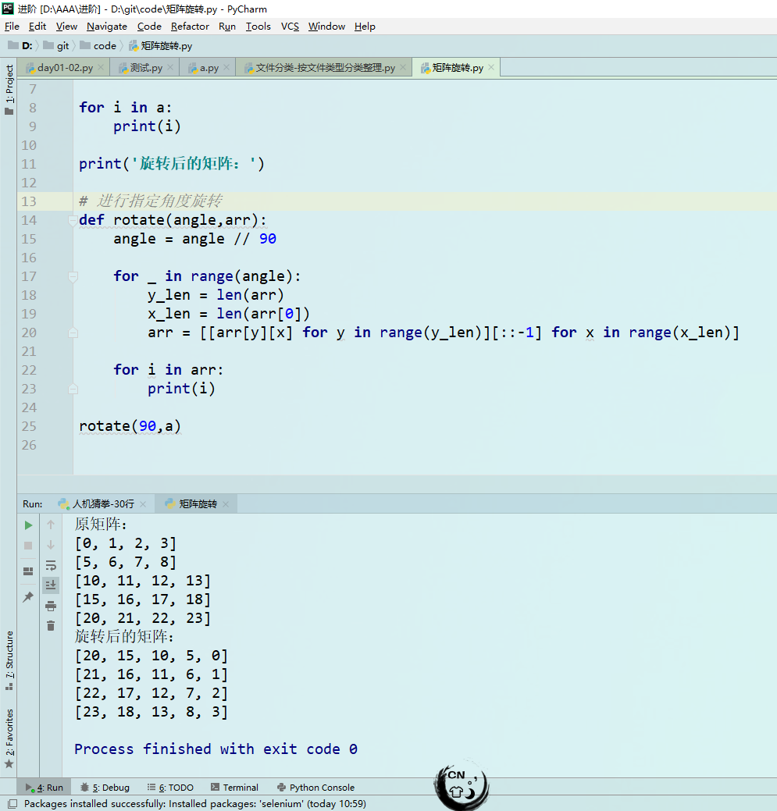
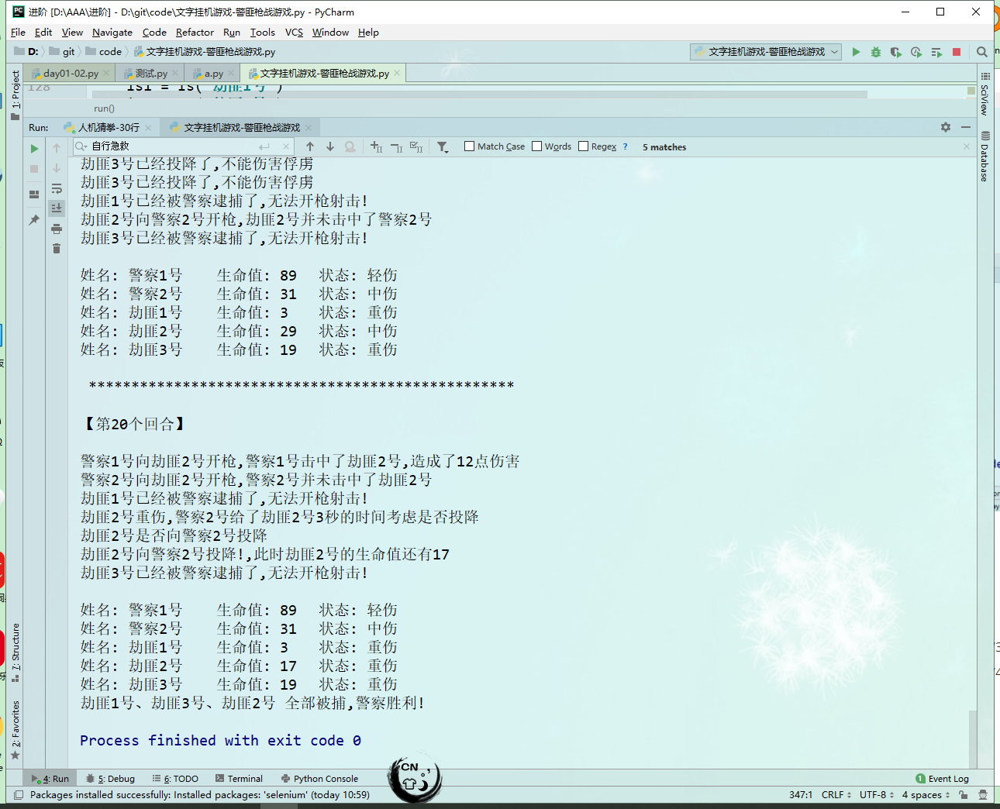

# 目录

[TOC]

##### 猜数字-7行

- 7行代码，主体使用三目运算，exec()在print()里修改变量的值

- 自定义范围
- 自定义次数
- 范围提示
- 可重复循环

<a href="#user-content-目录 ">跳转到目录</a>

##### 人机猜拳-30行

- 30行代码，主体还是三目，三次判断完所有情况
- 支持 数字1、2、3 替代 中文石头、剪刀、布
- 输入校验

<a href="#user-content-目录 ">跳转到目录</a>

##### 文件分类-按文件类型分类整理

- shutil 模块移动文件 os 模块创建目录和打开窗口

- 按文件类型进行分类
- 完成后弹出窗口

.png)

.png)

.png)

<a href="#user-content-目录 ">跳转到目录</a>

##### 矩阵旋转

- 顺时针旋转
- 使用生成式生成新矩阵

<a href="#user-content-目录 ">跳转到目录</a>

##### 文字挂机游戏-警匪枪战游戏

- 状态：满血、轻伤、中伤、重伤、死亡
- 警察技能：急救 - 血量低于20%的时候有1/3的概率触发。1/5概率回复30，4/5概率回复20
- 劫匪技能：投降 - 血量低于20%的时候有1/4的概率触发。投降后不可行动。自行急救 - 1/2回复15,1/2概率10

<a href="#user-content-目录 ">跳转到目录</a>

#### 彩色文字21点游戏-250行

- 四花色牌

- 单人和电脑，电脑和电脑
- 电脑先抽卡，点数不低于16
- 抽过牌不会重复抽取
- 爆点的时候如果有A牌能但1点，默认11点
- 电脑判断如果下一张牌爆点的概率大于50%将不抽牌

.png)

.png)

<a href="#user-content-目录 ">跳转到目录</a>